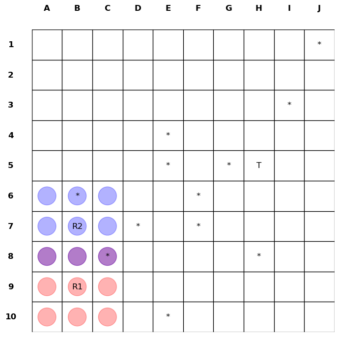

## Our Deliverables
* [Project Proposal](./proposal%20doc/MARL_Autonomous_Vehicle_Proposal.pdf)
* [Presenting Our Proposal](./MARL_autonomous_vehicle_proposal_presentation.pdf)
* [A Research Summary](./MARL-Lane_Changing-Presentation.pdf)

## Environment Outline

## LaTex Guide for Writing Reports
To work with LaTex locally on your IDE, follow the steps below: 
1. Install [MikTex](https://miktex.org/) as the LaTeX Distribution.
2. Install [Perl](https://strawberryperl.com/).
3. Install the VS Code Extension for previewing the LaTex in a PDF format, such as **LaTeX Workshop**.
4. Previewing and Exporting will be available in the `.tex` file. 

## Prerequisites for Executable Codes in this Project
* Create a Virtual Environment with this command on a terminal: `py -m venv marl_env`.
* Update pip to its latest version with this command: `py -m pip install --upgrade pip`.
* From the Virtual Environment, install all the dependencies with this command: `pip install -r requirements.txt`, or `conda install -p /MARL-autonomous-vehicle/.conda --file requirements.txt` if you use conda. Note: Use a **full path** for conda.
* Or you may find creating a virtual environment useful if you keep facing dependency issues. Just run the following command before installing libraries from pip: 
`
    python -m venv marl_env
    source marl_env/bin/activate  # (On Windowks: marl_env\Scripts\activate)
`.
* Atari is available via Gymnasium: <url>https://www.gymlibrary.dev/environments/atari/index.html</url>
* Clone the repository <url>https://github.com/damat-le/gym-simplegrid.git</url> to get the codes of a simple grid-based environment for customization. 

## Environment's Representation
### Array Representation
The rgb_array shape Image shape: (480, 640, 4) represents the dimensions and color channels of the rendered image of the environment. Here's a breakdown of what each dimension represents:

Breakdown of the Shape
Height (480): The first dimension (480) represents the **height** of the image in pixels.
Width (640): The second dimension (640) represents the **width** of the image in pixels.
Color Channels (4): The third dimension (4) represents the **color channels** of the image. In this case, there are 4 channels, which typically correspond to the RGBA color model:
* R: Red channel
* G: Green channel
* B: Blue channel
* A: Alpha channel (transparency)

Explanation
Height and Width: The height and width of the image determine the resolution of the rendered image. In this case, the image has a resolution of 480x640 pixels.
Color Channels: The 4 color channels (RGBA) provide information about the color and transparency of each pixel in the image. The alpha channel allows for transparency effects, which can be useful for rendering overlapping objects or semi-transparent elements.

### String Representation
When the environment is rendered in ansi mode, the render method generates a string that represents the current state of the environment. This string typically includes information such as the current step, the agent's position, the reward obtained, whether the episode has ended, and the agent's action.

Example:

`Step: 5, Agent Position: (2, 3), Reward: -1, Done: False, Action: (1, 0)`

### Visual Representation for debugging

### Algorithms
#### Leader's Message
- Distance to the nearest obstacle (obs_dist): int or float
- Relative position of the goal (xg): int, -1 if goal is not in partial observability.
- Relative position of the goal (yg): int, -1 if goal is not in partial observability.
- Whether the path is clear or blocked(path_blocked): 0/1 int
- Leader's action (action): int
- Leader can observe the follower or not (follower_visibility): 0/1 int
- Leaders distance to follower (follower_dist): float
- Sample: 
[-1, -1, np.float64(2.0), 1, np.float64(1.4142135623730951), 0]
#### Leader-Follower (encoder-decoder) Model

| Layer (type)       | Output Shape | Param # |
|---------------------|--------------|---------|
| input_layer_4       | (None, 8)    | 0       |
| dense_10 (Dense)    | (None, 64)   | 576     |
| dense_11 (Dense)    | (None, 64)   | 4,160   |
| dense_12 (Dense)    | (None, 9)    | 585     |

 * Total params: 5,321 (20.79 KB)
 * Trainable params: 5,321 (20.79 KB)
 * Non-trainable params: 0 (0.00 B)
 * Prediction: Outputs an array of 9 values, representing the probabilities of each possible action. 

 #### Policy Network Model
 * Evaluates the best move for an agent.

| Layer (type)           | Output Shape | Param #  |
|-------------------------|--------------|----------|
| input_layer_5          | (None, 8)    | 0        |
| reshape_1              | (None, 1, 8) | 0        |
| lstm_2 (LSTM)          | (None, 1, 64)| 18,688   |
| lstm_3 (LSTM)          | (None, 32)   | 12,416   |
| dense_13 (Dense)       | (None, 8)    | 264      |

 * Total params: 31,368 (122.53 KB)
 * Trainable params: 31,368 (122.53 KB)
 * Non-trainable params: 0 (0.00 B)
 * Input should include:
1. Agent's Position: The (x, y) coordinates of the agent in the grid.
2. Relative Position of the Goal: The relative position of the goal (xg, yg) with respect to the agent. If the goal is not visible, these values can be set to -1.
3. Distance to the Nearest Obstacle: A scalar value representing the distance to the nearest obstacle.
4. Path Blocked Indicator: A binary value (0 or 1) indicating whether the path is blocked by obstacles.
5. Follower Visibility: A binary value (0 or 1) indicating whether the leader can observe the follower.
6. Distance to Follower: A scalar value representing the distance between the leader and the follower.
 * Encoded Message is a compressed version of the leader's message which consists of 8 values in an array. 

 ## Execution Guide
* [**TMUX**](tmux.md) for idling long executions