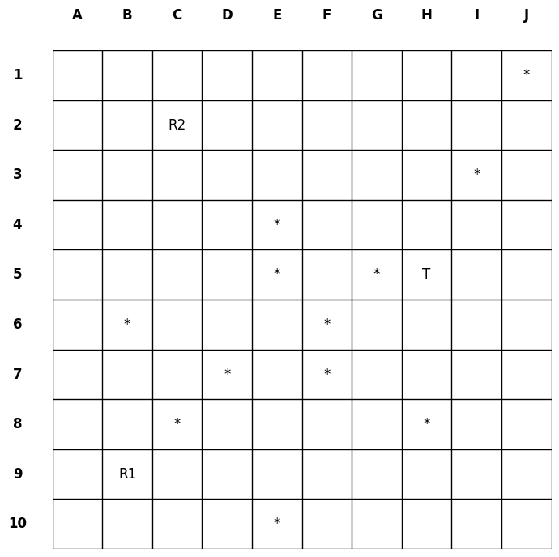

## Environment Outline

## LaTex Guide
To work with LaTex locally on your IDE, follow the steps below: 
1. Install [MikTex](https://miktex.org/) as the LaTeX Distribution.
2. Install [Perl](https://strawberryperl.com/).
3. Install the VS Code Extension for previewing the LaTex in a PDF format, such as **LaTeX Workshop**.
4. Previewing and Exporting will be available in the `.tex` file. 

## Prerequisites for Codes
* Create a Virtual Environment with this command on a terminal: `py -m venv marl_env`.
* Update pip to its latest version with this command: `py -m pip install --upgrade pip`.
* From the Virtual Environment, install all the dependencies with this command: `pip install -r requirements.txt`.
* Or you may find creating a virtual environment useful if you keep facing dependency issues. Just run the following command before installing libraries from pip: 
`
    python -m venv marl_env
    source marl_env/bin/activate  # (On Windowks: marl_env\Scripts\activate)
`
* Install [atari](https://pypi.org/project/gymnasium/) environment with Gym with this command: `pip install gymnasium[atari]`.